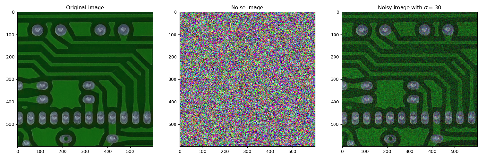
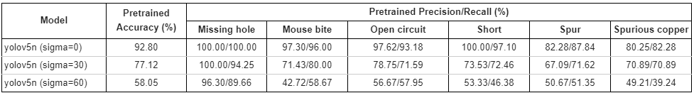

## Objective
This project involved replicating a State-of-the-Art (SOTA) paper concerning defect classification in PCB images and enhancing the results through fine-tuning existing models.

The PCB dataset contained six defect types, necessitating dataset augmentation due to its limited number of images. Augmentation involved random cropping, alongside the addition of Gaussian noise with sigma values of 0, 30, and 60, as per the baseline paper's recommendations.
For further insight, I have included detailed results in this portfolio.

## Results
