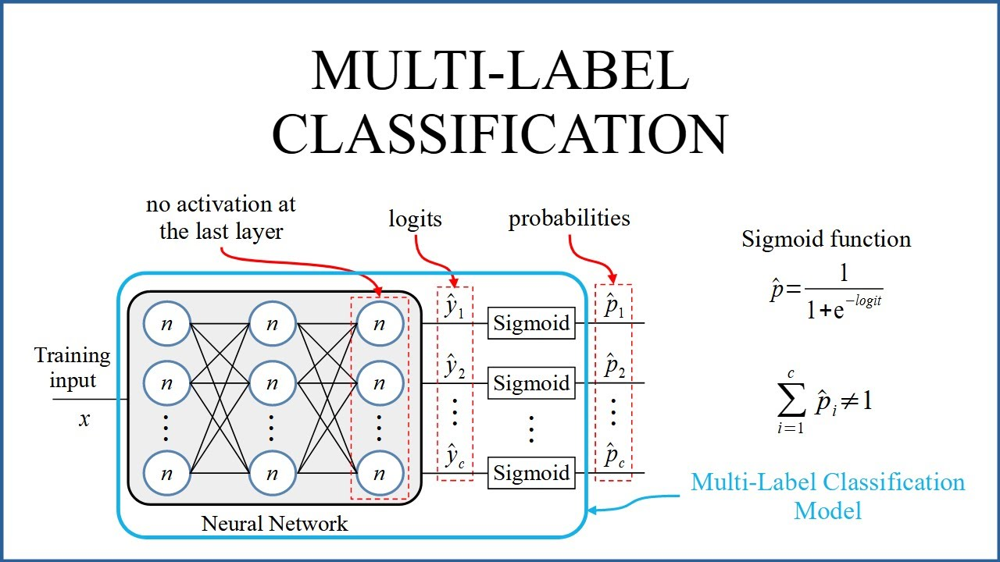

## Objective
The purpose of this project is to reproduce the SOTA result of FrameExit: Conditional Early Exiting for Efficient Video Recognition paper.

This research utilizes the Holistic Video Understanding (HVU) dataset primarily intended to facilitate action recognition experiments. However, it has been discovered that this dataset can also support experiments in multi-label video classification.

In this project, we encountered challenges reproducing the State-of-the-Art (SOTA) results due to the unavailability of algorithm code and unclear explanations hindering our reimplementation efforts. However, through leveraging existing models and making certain modifications, we ultimately surpassed the SOTA results. The State-of-the-Art mean Average Precision (mAP) stood at 49.2%, whereas our achieved mAP reached 49.28%.