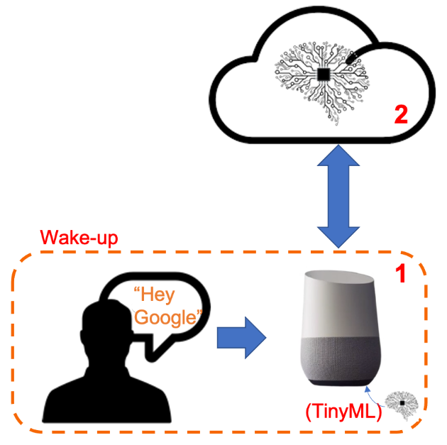

## Objective
The wake-up word project was launched to streamline certain speech applications. Instead of manually activating an Automatic Speech Recognition (ASR) application with a trigger button, the wake-up word feature allows for activation by specific user commands, such as "Hello system!" or "OK system!". Developing and experimenting with the wake-up word system is relatively straightforward.

1. The initial step involves defining the specific words or phrases to serve as the wake-up word.
2. I proceeded to determine the speech features to utilize, opting for features such as Mel-Frequency Cepstral Coefficients (MFCC) and Perceptual Linear Prediction (PLP). By experimenting with these selected features, I aimed to evaluate their performance and determine which one yields superior results.